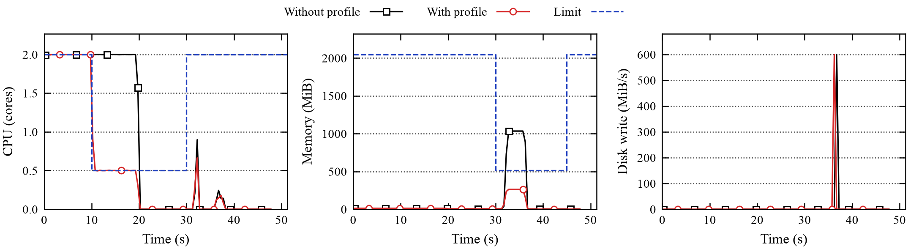

# rprof

rprof changes the CPU, memory, disk, network and process limits of a running Docker container
on a schedule you write, and records what the container used while each limit was in force.

Use it to test how an AI agent copes when its sandbox becomes slower or smaller partway through
a task.

```yaml
# squeeze.yaml: half a CPU core from 60 s to 120 s, then 1 GiB of memory until 180 s
version: 1
name: squeeze
segments:
  - {from: 60, to: 120, cpu: {cores: 0.5}}
  - {from: 120, to: 180, mem: {max: 1Gi}}
```

```bash
sudo rprof run --target docker:sbx --profile squeeze.yaml -- .venv/bin/python my_harness.py
cat runs/*-squeeze/report.md     # did each limit actually constrain the agent?
```

During the run, rprof:

- applies each limit at its scheduled time;
- samples the container's usage ten times a second;
- labels the samples with your harness's tool calls;
- explains failed calls, for example `Killed: memory limit 1 GiB reached`.

When the run ends, it restores the container's original limits.

## See rprof in action

This demo runs a short [Harbor](https://github.com/harbor-framework/harbor) task twice, once
under a profile and once without, and plots both. Harbor's `oracle` agent runs the task's own
script instead of calling a model, so the run is the same every time. The script stands in for
an agent's work:

```bash
# Runs in the container (examples/harbor/demo-task/solution/solve.sh)
stress-ng --cpu 2 --timeout 20s --quiet      # 0–20 s: two busy cores
sleep 12
hog-mem 1G 4 || hog-mem 256M 4               # ~32 s: hold 1 GiB for 4 s, or 256 MiB if that is killed
dd if=/dev/zero of=/app/blob bs=1M count=300 oflag=direct status=none   # write 300 MiB
```

The profile (`examples/harbor/squeeze.yaml`) keeps the task's own budget of 2 cores and 2 GiB,
except for half a core from 10 to 30 s and 512 MiB of memory from 30 to 45 s:

```yaml
defaults: {cpu: {cores: 2}, mem: {max: 2Gi, swap_max: 2Gi}}
segments:
  - {from: 10, to: 30, cpu: {cores: 0.5}}
  - {from: 30, to: 45, mem: {max: 512Mi, swap_max: 0}}
```

One command runs the task under the profile. `--target harbor` starts Harbor, waits for the
agent to start in the container Harbor creates, and applies the profile from that moment:

```bash
sudo rprof run --target harbor --profile examples/harbor/squeeze.yaml --name with -- \
  harbor run -p examples/harbor/demo-task -a oracle -y
sudo rprof run --target harbor --mode measure --name without -- \
  harbor run -p examples/harbor/demo-task -a oracle -y
rprof plot runs/*-without runs/*-with --label "Without profile" --label "With profile" -o demo.png
```



- **CPU.** Without the profile, the script keeps both cores busy for 20 s. With it, rprof cuts
  the container to exactly 0.5 cores at 10 s. `stress-ng` stops at 20 s either way, so the
  limited run simply did less work.
- **Memory.** At 30 s the limit drops to 512 MiB. The 1 GiB step hits it and is killed; rprof
  records the kill at about 32 s, and the script's retry holds 256 MiB instead. Without the
  profile, the step holds the full 1 GiB.
- **Disk.** The 300 MiB write runs at full speed in both runs, because the profile doesn't limit
  disk.

Time 0 is when the agent started, after Harbor built and started the container. Each run's
`report.md` sums it up: the limited run peaked under 512 MiB with one OOM kill, the other at
1 GiB with none. Each run takes about a minute; it needs Harbor (`uv tool install harbor`) and the test
image (`docker build -t rprof-testbox images/testbox`). See
[Run Harbor tasks](docs/guides/harbor.md) for real agents.

## Install

rprof needs Linux with cgroup v2, the standard Docker daemon (not rootless Docker), Python 3.11
or later, and [uv](https://docs.astral.sh/uv/).

```bash
git clone https://github.com/ronyw7/rprof.git && cd rprof
uv sync --extra plot
sudo ln -sf "$PWD/.venv/bin/rprof" /usr/local/bin/rprof    # so that `sudo rprof` works
sudo rprof doctor
```

## Documentation

- [Getting started](docs/getting-started.md): limit a container's CPU and memory and see the
  effect, in about 10 minutes.
- [Key concepts](docs/key-concepts.md): targets, knobs, profiles, segments and runs.
- User guides: [write a profile](docs/guides/writing-profiles.md),
  [choose limits](docs/guides/limits.md), [connect your harness](docs/guides/harness.md),
  [run Harbor tasks](docs/guides/harbor.md),
  [read the results](docs/guides/results.md), [set up a host](docs/guides/host-setup.md).
- Reference: [CLI](docs/reference/cli.md), [profile format](docs/reference/profile.md),
  [Python client](docs/reference/client.md), [control protocol](docs/reference/protocol.md),
  [run directory](docs/reference/run-directory.md).

## Versions

rprof's version comes from git, so every commit has its own and runs record exactly which code
produced them (`rprof_version` in each run's `meta.json`, and `rprof --version`):

| Checkout | Version |
| --- | --- |
| A release tag, `v0.1.0` | `0.1.0` |
| 3 commits after `v0.1.0` | `0.1.1.dev3+g1a2b3c4d5` |
| The same, with uncommitted changes | `0.1.1.dev3+g1a2b3c4d5.d20261005` |

This is the scheme setuptools-scm uses. Running from a git checkout, rprof reads the version
from git when it starts, so `git pull` updates it without reinstalling. To make a release, tag it
and push the tag: `git tag -a v0.2.0 -m "rprof 0.2.0" && git push --tags`.

## Development

```bash
uv run --extra plot pytest tests/unit     # no root needed
sudo env PYTHONDONTWRITEBYTECODE=1 RPROF_HARBOR=$(command -v harbor) \
  .venv/bin/pytest -p no:cacheprovider tests/integration tests/e2e tests/harbor
scripts/sync-remote.sh <host>             # copy the tree to a Linux host and set up its environment
```

The integration, end-to-end and Harbor tests need root, Docker, cgroup v2 and the test images
(`docker build -t rprof-testbox images/testbox`, and the same for `images/netpeer`). The Harbor
tests also need Harbor (`uv tool install harbor`); they run real Harbor trials with its `oracle`
agent, so no model or API key.
`PYTHONDONTWRITEBYTECODE=1` stops root from leaving cache files that your user can't delete.

CI (`.github/workflows/ci.yml`) runs the unit tests on Python 3.11 and 3.12, then the
integration, end-to-end and Harbor tests as root on a GitHub-hosted Ubuntu VM. It skips tests marked
`timing`, whose pass bands (measured CPU, bandwidth, latency, rprof's own overhead) assume a
quiet, dedicated machine. Run the full suite, timing tests included, on the experiment host
before each batch of runs.
